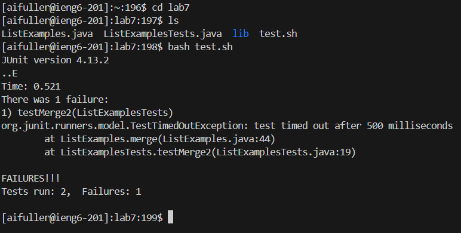

# LAB REPORT FOUR
Aidan Fuller   5/22/2024

---

# Step 4

`ssh<space>aifuller@ieng6.ucsd.edu><enter>` 

To log into my `ieng6` server, I simply typed in `ssh` followed by my `ieng6` login email which put me in the remote machine environment. Since I already had the access keys properly set up from an earlier lab, the server recognized my machine and connected the two without need for any password.  

  

---

# Step 5

`git<space>clone<space><ctrlv><enter>`

To clone the repository into the remote environment, I copied the forked `lab7` repository link from the SSH section of my forked `lab7` Github page and typed in `git clone` to clone its contents into my terminal so I could access them. 

  

---

# Step 6

`cd<space>lab7<enter>`  
`ls<enter>`  
`bash<space>grade.sh<enter>`

To test `JUnit` tests I ran the `grade.sh` bash script. First I changed the working directory I was in to `lab7` and then used `ls` to ensure all of the expected files were there. Next, I ran the script which resulted in one test passing while the other failed.

  

---

# Step 7
`vim<space>ListsExamples.java<enter>`  
`<esc>:44<right><right><right><right><right><x>2<esc>:wq<enter>`

In order to ensure both tests pass, I needed to make minor edits to the `ListExamples.java` file in the `lab7` directory, so I used `vim` to open it and display its contents. To save time and keystrokes, I used `:44` in order to skip directly to line 44 and from there I simply moved the cursor over to the right a few times and then replaced the incorrect `index1` variable with `index2`. I then entered normal mode again and typed `:wq: to exit the vim environment while saving my changes. One useful thing about vim is the variety of commands it has that can be used as shortcuts, and the `:44` shortcut was especially useful in this case because it saved me from having to traverse all the way down to the line I wanted one line at a time, instead I was able to instantly get there.

  

---

# Step 8
`bash<space>grade.sh`

Now that I had fixed the `ListExamples.java` file, I ran the tests again using the same command as I had done previously, and both tests passed without error.

  

---

# Step 9
`git<space>add<space>.<enter>`
`git<space>commit<space>-m<space>"Lab Report Done"<enter>`

After successfully fixing the tests, I used the `git add` command to save all of the edits I had made and then used the `git commit` command to commit my newly updated files into my forked repository back on Github. 

  

