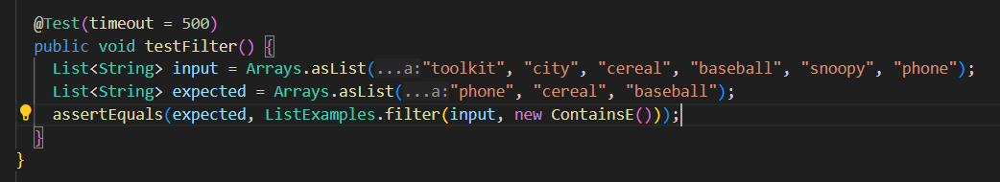

## LAB REPORT FIVE
Aidan Fuller <br> 6/4/2024

# Part 1 - Debugging Scenario
---
> **private question @5**
---

Hello, I am having trouble with my autograder `grade.sh` script for Lab 6. I have designed it to display the number of tests that are passing in my program and everything seems to work except the score part, where it keeps saying `Total Score Is: 0 out of 1`. I've looked over the bash script and I can't find any reason as to why it keeps displaying zero, but there must be some issue. The autograder must be broken!!! 

Here is an image of my autograder: <br>
 <br>


---
> **the instructors' answer**
---
While it is still possible that your bash script contains an error as I cannot see the entire command in the screenshot, there don't appear to be any errors in the declaration or calculation of the `result` variable. <br>

Please provide more information to help debug, such as screenshots of the method and test case that your bash script is currently running. 

---
> **students' response**
---
Here is an image of the test case: <br>
 <br>

Here is an image of the filter method: <br>
 <br>

---
> **instructors' response**
---
Ah, I see where the error is. Your bash script seems to be calculating the amount of tests passed without problem, the issue lies within your test case! If you look to the line in your `filter` method that states `result.add(0, s);`, be mindful of the fact that you are adding each new item to the **front** of your new filtered list, not the back. Therefore, your `grade.sh` autograder works fine, but you need to fix your test case. 


---
> **students' response**
---
I get it now, thank you! My test case was capturing the words `cereal`, `baseball`, and `phone` as words that contained `E`, but I had set up my expected list in a random order. It should have been in the reverse order as to how they appeared in the original list because each new word added pushes the first word an index back. I fixed that in the test case, but I am still receiving an issue, now within my bash script. If all of the test cases are correct, instead of showing `1 out of 1` it just shows ` out of ` and I can't figure out why. Here is a screenshot of the `result.txt` file that my `grade.sh` bash script is using to calculate the values of failures and tests run. 

 <br>

 <br>


---
> **instructors' response**
---
I see where the issue is here as well. When you get all of the tests correct, there is no indication of `Failures:` or `Tests Run:` within `Results.txt`, because the displayed message is different and just contains `OK (X Tests`. This means that if **all** of your tests properly pass, there is no way for the `failures` or `testsRun` variables to be selected using the `grep` command. I would recommend using an `if else` statement in order to add a case depending on whether or not all the tests pass or fail, and then accessing the amount differently based on the condition. 

---
> **students' response**
---
That makes so much sense, thank you for your help! I added an `if else` statement to determine whether or not 100% of the tests passed, and then I determined the `testsRun` value a different way. Now when I run it, the output properly lists `Total Score Is: 1 out of 1`. Thank you so much for all of your help!
 <br>

---

# File Contents:


### For this lab report, I used the basic structure from the `list-examples-grader` repository used during the Week 6 Lab
`https://github.com/ucsd-cse15l-s24/list-examples-grader`

#### Command Ran to Trigger Bugs : 
```
$ bash grade.sh https://github.com/ucsd-cse15l-f22/list-methods-lab3
```

#### Customized Contents of `TestListExamples.java` : 
```
import static org.junit.Assert.*;
import org.junit.*;
import java.util.Arrays;
import java.util.List;

class ContainsE implements StringChecker {
  public boolean checkString(String s) {
    return s.contains("e");
  }
}

public class TestListExamples {
@Test(timeout = 500)
    public void testFilter() {
    List<String> input = Arrays.asList("toolkit", "city", "cereal", "baseball", "snoopy", "phone");
    List<String> expected = Arrays.asList("phone", "cereal", "baseball");
    assertEquals(expected, ListExamples.filter(input, new ContainsE()));
  }
}
```
To fix the bug in this test case, swap `cereal` and `baseball` in the string `expected` in order to ensure that the test case passes. Additionally, ensure the bugs in `ListExamples.java` have been fixed. 

#### Customized Contents of `grade.sh` : 
```
CPATH='.;lib/hamcrest-core-1.3.jar;lib/junit-4.13.2.jar'

rm -rf student-submission
rm -rf grading-area

mkdir grading-area

git clone $1 student-submission
echo 'Finished cloning'

if [[ -f student-submission/ListExamples.java ]] 
then 
    echo "ListExamples.java exists"
else 
    echo "ListExamples.java does not exist"
    echo "Grade: 0"
    exit 
fi 

cp student-submission/ListExamples.java TestListExamples.java grading-area
cp -r lib grading-area

cd grading-area
javac -cp $CPATH ListExamples.java TestListExamples.java 

if [[ $? == 0 ]] 
then
    echo "Compilation was successful"
else 
    echo "Compilation was not sucessful"
    echo "Grade: 0"
    exit 
fi 

echo "The exit code of javac is $?" 

java -cp $CPATH org.junit.runner.JUnitCore TestListExamples > results.txt 

failures=`grep "Tests run:" results.txt | cut  -d ':' -f 3`
testsRun=`grep "Tests run:" results.txt | cut  -d ':' -f 2 | cut -d ',' -f 1` 

result=$(( testsRun - failures ))
echo Total Score Is: $result out of $testsRun 

rm -rf student-submission
rm -rf grading-area
```

To fix bugs, edit the `grep` section of the bash script to add an `if else` statement: 
```
if grep -q "Tests run:" results.txt; 
then

    failures=`grep "Tests run:" results.txt | cut  -d ':' -f 3`
    testsRun=`grep "Tests run:" results.txt | cut  -d ':' -f 2 | cut -d ',' -f 1` 

    result=$(( testsRun - failures ))
    echo Total Score Is: $result out of $testsRun 
else 

    testsRun=`grep "(" results.txt | cut -d '(' -f 2 | cut -d ' ' -f 1`
    echo Total Score Is: $testsRun out of $testsRun 
fi
```
---
# Part 2 – Reflection
---

I found it funny that just now in writing this lab report and designing a mockup piazza discussion, I ran into an issue with the `grade.sh` script that my group worked on during the Week 6 and 9 labs. It wasn't a syntax error, but it was a limitation of the code that we never encountered in lab. I hadn't planned on it even being a part of the piazza discussion but I really enjoyed the process of figuring out how to improve by bash script to account for more potential cases that it might run into so I felt that it would be perfect to add onto the post as a followup discussion between the student and the TA that was helping them. Using the bash script commands like `grep` to pull out specific data from an output was very interesting to me and it gave me an insight as to how the autograding for so many of my past classes has worked. I'm eager to do more projects where I'm able to use other output data within programs to print specific things or lead into other commands. I feel much more confident in being able to debug code now that I have taken this course, as I feel more familiar with common issues I might run into but I have also learned debugging tools such as `jdb` which will certainly help me narrow down the root causes behind issues I may run into with programming assignments in my future courses. I had never done anything like bash scripting and I had only used terminals a handful of times before taking this class, so I found it all super interesting and I am excited to be able to apply my newly learned skills to more projects throughout my career. 


